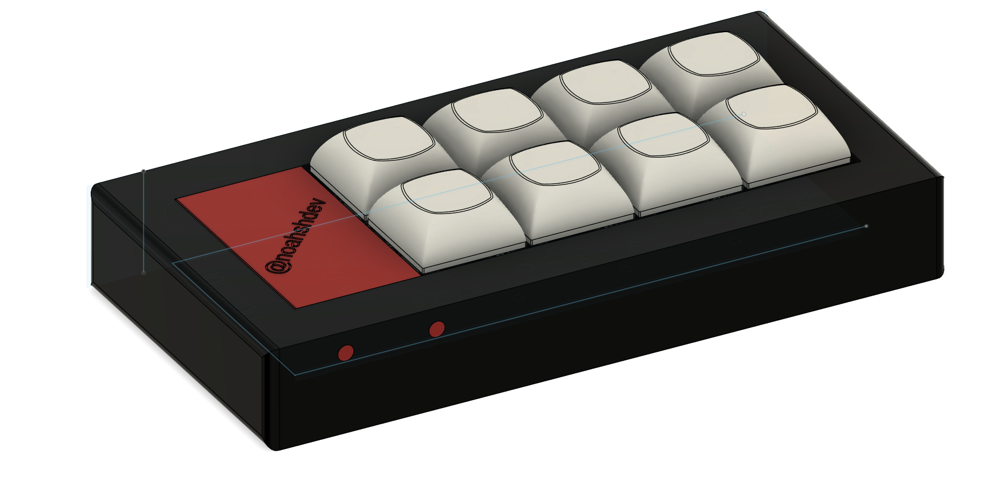
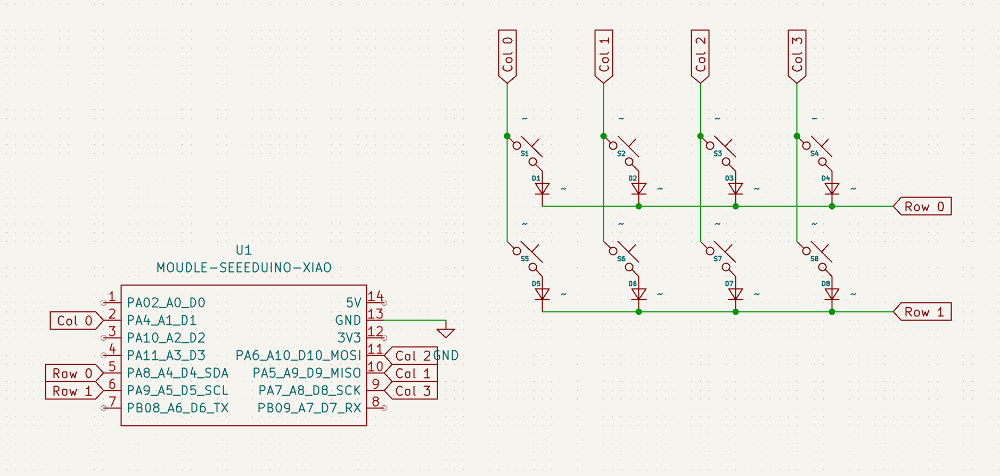
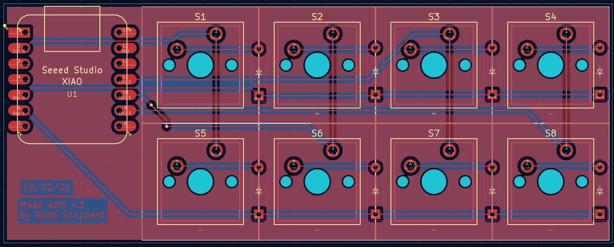

# Noah's Macropad

An 8-key custom macropad built around the Seeed XIAO RP2040, with a custom PCB, 3D-printed case, and Arduino firmware that supports runtime key remapping.

## Project Overview

- **MCU:** Seeed XIAO RP2040 (through-hole)
- **Inputs:** 8 MX-style switches
- **Firmware:** Arduino (`firmware/noahs_macropad/noahs_macropad.ino`)
- **PCB Tooling:** KiCad
- **Case/CAD:** Fusion 360 export (`cad/noahs-macropad.3mf`)

## Required Design Screenshots

### Overall Hackpad

### Schematic

### PCB

### Case Fit / Assembly

## BOM

| Part Name | Quantity |
|---|---:|
| Case | 1 |
| Seeed XIAO RP2040 | 1 |
| through-hole 1N4148 Diode | 8 |
| MX-Style Switch | 8 |
| DSA Keycap | 8 |

Source file: [`bom.csv`](bom.csv)

## Repository Structure

- `cad/` — complete case/assembly model (`noahs-macropad.3mf`)
- `pcb/` — KiCad source files (`.kicad_pro`, `.kicad_sch`, `.kicad_pcb`) and exports
- `firmware/` — Arduino firmware and configuration tooling
- `production/gerbers/` — generated manufacturing Gerber/drill files

## Firmware

- Main sketch: `firmware/noahs_macropad/noahs_macropad.ino`
- Config utility: `firmware/config_tool.py`
- Firmware details: see `firmware/README.md`

## Production Files

Current production outputs included in this repo:

- PCB Gerbers and drill files in `production/gerbers/`

## Notes

The PCB in the .3mf vs the KiCad exports will be slightly different, as the name went over a trace, causing DRC errors so quickly changed that in KiCad, and as it isn't mission critical, the 3mf won't be updated. 

## Author

Noah Sheppard (noahshdev)
