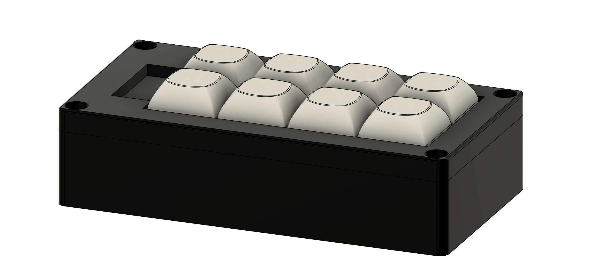
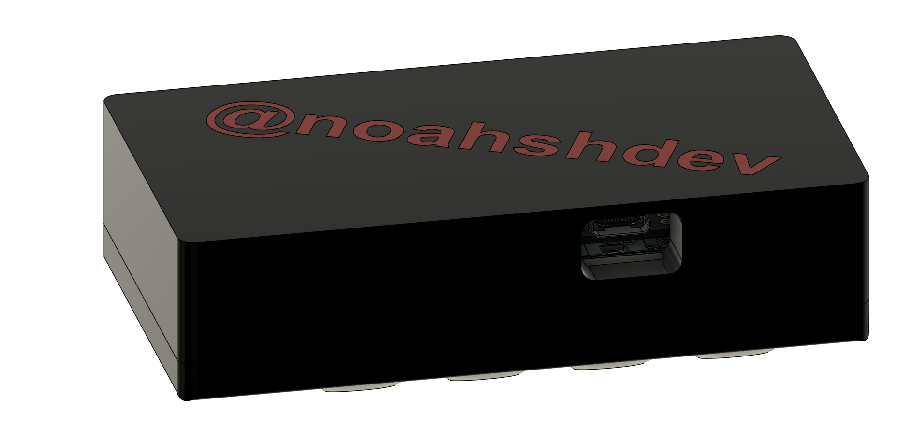
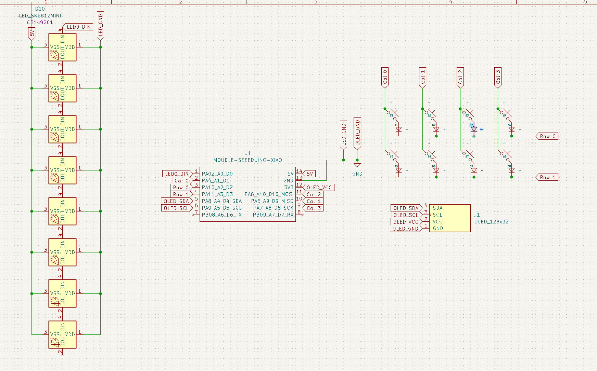
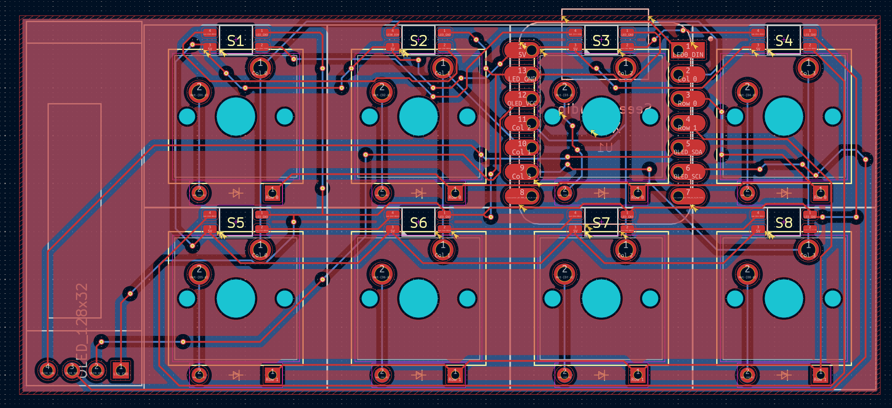
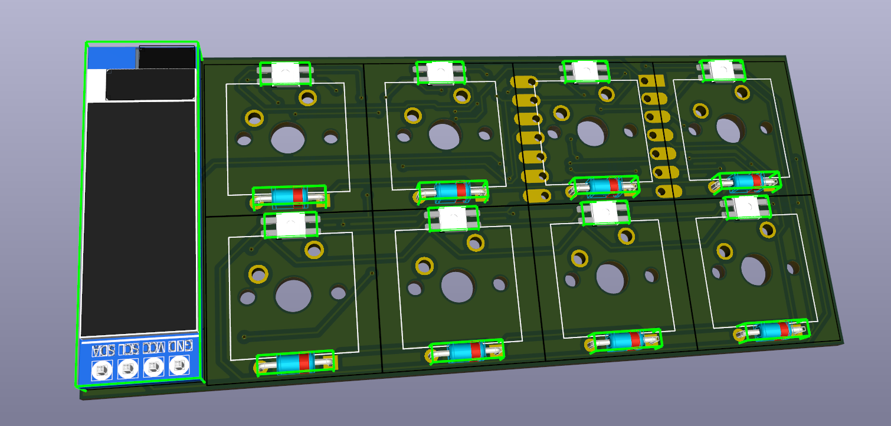

# Noah's Macropad

An 8-key custom macropad built around the Seeed XIAO RP2040, with a custom PCB, 3D-printed case, and Arduino firmware that supports runtime key remapping.

## Photos of my beautiful hackpad

### Overall Hackpad

### Schematic

### PCB

## BOM

| Part Name | Quantity |
|---|---:|
| Case | 1 |
| Seeed XIAO RP2040 | 1 |
| through-hole 1N4148 Diode | 8 |
| MX-Style Switch | 8 |
| DSA Keycap | 8 |

Source file: [`bom.csv`](bom.csv)

## Production Files

Current production outputs included in this repo:

- PCB Gerbers and drill files in `production/gerbers/`

## Author

Noah Sheppard
